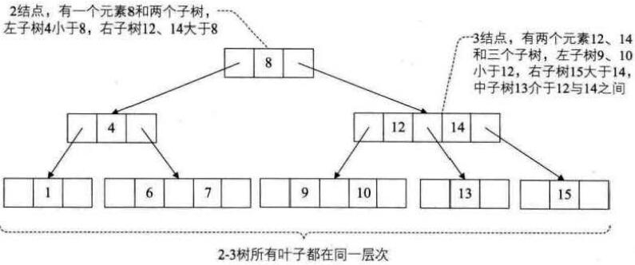
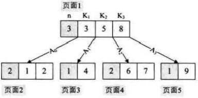

# 大话数据结构

<!-- TOC -->

- [1 数据结构绪论](#1-数据结构绪论)
- [2 算法](#2-算法)
- [3 线性表](#3-线性表)
- [4 栈和队列](#4-栈和队列)
- [5 串](#5-串)
- [6 树](#6-树)
- [7 图](#7-图)
- [8 查找](#8-查找)
- [9 排序](#9-排序)

<!-- /TOC -->

## 1 数据结构绪论

> 数据结构是一种研究非数值计算的程序设计问题的操作对象，以及它们之间的光合和操作等相关问题的学科。
> **程序设计 = 数据结构 + 算法**

- 基本概念和术语：
  1. 数据：可以**输入到计算机**并**被计算机所处理**的描述客观事物的**符号**。
  2. 数据元素：组成数据的、有一定意义的**基本单位**。
  3. 数据项：数据不可分割的最小单位。
  4. 数据对象：是性质相同的数据元素的集合，是数据的子集。
  5. 数据结构：是相互之间存在一种或多种特定关系的数据元素的集合。
- 解释：
  - 数据是符号的子集，满足两个条件：能输入到计算机，能被计算机处理。比如图片，文本
  - 数据对象是数据的子集：数据由不同种类的数据对象组成。比如人群，城市网
  - 数据元素是数据对象的最细粒度单位：数据对象由性质相同的数据元素组成。比如人，城市
  - 数据项：数据元素的各种属性。比如眼睛，鼻子
  - 数据结构：用来描述数据元素之间的关系。比如链表，二叉树
- 逻辑结构与物理结构
  - 逻辑结构：数据对象中数据元素之间的相互关系。
    - 集合结构：如set
    - 线性结构：如list
    - 树形结构：如二叉树
    - 网络结构：如有向图
  - 物理结果：逻辑结构在计算机中的存储形式。(存储区别于存取)
    - 顺序存储结构：如数组
    - 链式存储结构：如链表
- 抽象数据类型 (Abstract Data Type, ADT)
  - 数据类型：一组性质相同的值的集合及定义在此集合上的一些操作的集合。(属性+方法)
  - C语言为例：
    - 原子类型：是不可以再分解的基本类型，包括整形、实型、字符型等。
    - 结构类型：若干类型组合而成，可分解。如整形数组有若干整形数据组合而成。

## 2 算法

> 算法是解决特定问题求解步骤的描述，在计算机中表现为指令的有限序列，并且每条指令表示一个或多个操作。

- 算法五大特性：
  - 输入：个数 `>=0`
  - 输出：个数 `>0`。
  - 有穷性：执行有限步骤结束，每个步骤在可接受的时间内完成。
  - 确定性：算法的每一个步骤都具有明确的含义，不能出现二义性。
  - 可行性：(可上机运行) 算法每一个都能够通过执行有限次数完成。
- 算法四大要求
  - 正确性：满足五大特性切正确反映问题的需求，能够得到问题的正确答案。
    1. 没有语法错误。
    2. 对合法输入能够产生正确输出。(包括边界输入)
    3. 对非法输入能够产生满足规格说明的输出。
    4. 对精心选择的、甚至刁难的测试数据都有满足要求的输出。
  - 可读性：便于阅读、理解和交流
  - 健壮性：能对非法输入做适当处理。
  - 时间效率高和存储量低：时间复杂度和空间复杂度尽可能低。
- 算法的度量方法：
  - 事后统计：运行benchmark程序和数据，统计和比较运行时间。不够科学和准确。
  - 事前估计：在程序编制运行前，依据统计方法对算法进行估算。
- 函数的渐进增长：
  - 程序的运行时间取决于算法的好坏和输入的规模。
  - 函数的渐进增长：给定两个函数 `f(n)` 和 `g(n)` ，如果存在一个整数 N ，使得对于所有的 `n > N`, `f(n)` 总是比 `g(n)` 大，那么，我们说 `f(n)` 的增长渐进快于 `g(n)`。
- 算法的时间复杂度
  - 在进行算法分析时，语句总的执行次数 `T(n)` 是关于问题规模 `n` 的函数，进而分析 `T(n)` 的数量级。算法的时间复杂度，也就是算法的时间度量，记做 $T(n)=O(f(n))$
  - $O$ 渐进上界；$\Omega$ 渐进下界；$\Theta$ 渐进上下界
  - 算法复杂度有平均复杂度和最快复杂度，通常情况下指**最坏复杂度**
  - 常用时间复杂度次序：
    $$O(1)<O(log _n)<O(n)<O(nlog _n)<O(n^2)<O(n^3)<O(2^n)<O(n!)<O(n^n)$$
  - 递归复杂度求解: 主定律和递归树
  - 主定律：$T(n) <= aT(n/b) + n^d$
    $$T(n)=
    \begin{cases} 
		O(n^d \log n),    & d = \log _ab\\ 
		O(n^d),           & d > \log _ab \\
        O(n^{\log _ab}),  & d < \log _ab
	\end{cases}$$


- 算法的空间复杂度
  - 与时间复杂度类型是，通过计算算法所需的存储空间随输入规模的增长。公式记作：$S(n)=O(f(n))$

## 3 线性表

> 线性表(List)：**零个或多个数据元素的有限序列**。
> 线性表是有序的，记作 $(a_1, ..., a_{i-1}, a_i, a_{i+1}, ..., a_n)$，n 为长度。
> 除首尾元素以外，其他元素有且仅有一个直接前驱和直接后继。

- 物理存储方式：
- 顺序存储结构：
  - 按索引和地址关系随机存取访问(区别于顺序存储)
  - 注意区分数据长度和线性表长度：如 `vector` 中的 `capacity` 和 `size`。
  - 优点：
    - 无需为表中元素之间的逻辑关系而增加额外的存储空间。
    - 可以快速地存取表中的任一位置的元素。
  - 缺点：
    - 插入和删除操作需要移动大量的元素
    - 当线性表长度变化较大时，难以确定存储空间的容量。
    - 造成存储空间的“碎片”
- 链式存储结构。
  - 区分头指针和头结点的异同
    - 头指针是指向第一个节点的指针，若链表有头结点，这指向头结点的指针。
    - 头指针具有表示作用，所以常用头指针冠以链表的名字。
    - 无论链表是否为空，头指针均不为空。头指针是链表的必要元素。
    - 头结点是为了操作的同意和方便而设立的，放在第一个元素结点之前，其作用域一般无意义（也可存放链表的长度）。
    - 有了头结点，对在第一元素结点前的插入结点和删除第一结点，其操作与其他结点的操作就统一了。
    - 头结点不一定是链表不许要素。
  - 链表创建方法分：头插法和尾插法。

    |       存储分配方式     |      时间性能      |          空间性能      |
    | --------------------- | ----------------- | --------------------- |
    |:small_orange_diamond: 顺序存储结构用一段连续<br>的存储单元一次存储线性表的<br>数据元素；<br>:small_orange_diamond:单链表采用链式存储结构，<br>用一组任意的存储单元存放<br>线性表的元素。  |:small_orange_diamond:查找<br> :paperclip: 顺序存储结构：O(1)<br> :paperclip: 单链表：O(n)<br>:small_orange_diamond:插入和删除<br> :paperclip: 顺序结构存储：O(n)<br> 平均移动表长一半的元素)<br>:paperclip: 单链表：O(1)| :small_orange_diamond:顺序存储结构需要预<br>分配空间，分大了浪费，<br>分小了易发生溢出；<br>:small_orange_diamond:单链表无需分配空间，<br>只要有就可以分配，<br>元素个数也不受限制。 |

- 循环单链表
  - 将单链表的尾指针由空指针改为指向头结点，就使得整个单链表形成了一个环，这种头尾相接的单链表称为单循环链表，简称循环链表。
  - 为了使得空循环链表和非空循环链表处理一致，通常设一个头结点。但非必须。
  - 尾结点：访问头元素结点 (rear->next->next) 和尾结点都是 O(1)。合并两个循环链表也只需要 O(1)。
  ```c
  ListNode* p = rear1->next;  // 寄存A链表头结点
  rear1->next = rear2->next->next;  // 将B链表首元素结点接在A链表后面
  rear2->next = p;  // 将B链表的尾指针指向A链表的头结点
  free(p);  // 释放B链表的头结点
  ```
- 双向链表
  - 优点：可以正向和反向遍历查找元素。
  - 缺点：插入和删除时需要额外调整两个指针。
    ```c++
    // 双链表插入 p是插入前结点 s是待插入的新节点
    s->prior = p;
    s->next = p->next;
    p->next = s;
    s->next->prior = s;
    // 双链表删除 p是待删除的结点
    p->prior->next = p->next;
    p->next->prior = p->prior;
    free(p);
    ```

## 4 栈和队列

> 栈 (Stack) 是限定仅在表尾进行插入和删除操作的线性表。
> 我们把允许插入和删除的一端称为栈顶 (top)，把另一端称为栈底 (buttom)，不含任意数据元素的栈称为空栈。插入和删除操作分别称为入栈和出栈。
> 栈又称为后进先出 (Last In First Out) 的线性表，简称 `LIFO` 结构。

- 顺序存储的栈：顺序栈。需要预先分配空间，容易出现栈溢出的情况。可以采用两栈共用空间：从两边向中间扩展。
- 链式存储的栈：栈链。采用首元素结点作为 top，不需要头结点。入栈头插，出栈头删。
- 栈的应用
  - 保存中间状态：递归，DFS，二叉树的前中后序遍历等。
  - 四则运算，逆波兰：后缀表达式求解。中缀经栈转后缀，后缀经栈求输出。

> 队列 (queue) 是只允许在一端进行插入操作，而在另一端进行删除操作的线性表。
> 允许插入的一端称为队尾 (rear)，允许删除的一端称为队头 (front)。参入和删除操作分别称为入队和出队。
> 队列是一种先进先出 (First In First Out) 的线性表，简称 `FIFO` 结构。

- 循环队列：收尾相接的顺序存储结构称为循环队列。
  - 队列为空：`front == rear`, 队列为满：`(rear+1) % maxsize == front`。
  - 求队列长度：`(rear - front + maxsize) % maxsize`
- 链式存储队列：单链表保存头尾指针，尾进头出。

## 5 串

> 串 (string) 是由零个或多个字符组成的有限序列，又名字符串。一般记作 $s="a_1a_2...a_n"$
> n 称为串的长度，零个字符的串称为空串 (null string)
> **从 c++11 开始, std::string 统一为以 '\0' 为结束。**

- 字符串匹配：主串长 S 为 n，模式串 T 长为 m，
  - 朴素匹配算法：$O((n-m+1)*m)$
  - KMP算法：$O(m+n)$ 适用于模式串与主串之间存在较多“前部分匹配”的情况。
    - 求 `next` 数组：$mam\_match\_len$ 为字符前串的真前后缀最大匹配长度。
      $$next[i]=
      \begin{cases}
          0, & j = 0 \\
          1 + mam\_match\_len, & j > 0
      \end{cases}$$
  - KMP 改进算法：使用 `next` 数组的场景是匹配失败时，即下一个字符必定不同，如果下一个字符相同，则必定再次匹配失败。
    - 求 `nextval` 数组：在 `next` 的基础上，如果当前字符匹配 next 字符，`next` 前溯。
    - 例如：

        |   模式串   | next 数组 | nextval 数组 |
        | :-------- | :-------- | :----------- |
        | ababaaaba | 011234223 | 010104210    |
        | aaaaaaaab | 012345678 | 000000008    |

  - 代码实现：[c++](kmp.cpp)，特别注意 前文下标从 1 开始，c++ 下标从 0 开始，因此 `next` 少 1。
- 最长回文：[manacher](src/manacher.cpp)

## 6 树

> 树 (Tree) 是 n(n>=0) 个结点的有限集。 n=0 是称为空树。在任意一棵非空树中：
> (1) 有且仅有一个特称为根 (root) 的结点；
> (2) 当 n>1 时，其余结点可分为 m(m>0) 个互不相关的子树(SubTree)。

- 树的相关概念:
  - 结点的度
    - 结点拥有的子树数称为**结点的度 (Degree)**，**树的度**为各结点度的最大值。
    - 度为 0 的结点称为**叶结点 (Leaf)**，度不为 0 的结点称为**分支结点**。
  - 亲子关系：结点的子树的根称为该结点的**孩子 (Child)**，该结点称为孩子结点的**双亲 (Parent)**。
  - 结点的层次 (Level)：以根为第一层，根的孩子为第二层，往下数。结点的最大层次称为**树的深度 (Depth) 或高度**
  - 森林 (Forest)：是 m(m>=0) 棵互不相交的树的集合。
- 线性表和数的对比

    |      线性表    |      树      |
    | :------------ | :----------- |
    |:small_orange_diamond: 第一个数据元素：无前驱<br>:small_orange_diamond: 最后一个数据元素：无后继<br>:small_orange_diamond: 中间元素：一个前驱一个后继|:small_orange_diamond: 根结点：无双亲，唯一<br>:small_orange_diamond: 叶节点：无孩子，可以多个<br>:small_orange_diamond: 中间结点：一个双亲多个孩子|
    
- 树的存储结构
  - 双亲表示法：在每个结点中，附设一个指示器指示双亲结点到链表的位置。缺点，找孩子必须遍历结点。
  - 孩子表示法：每个结点有多个指针域，其中每个指针指向一个子树的根结点。又称多重链表表示法。具体上，将每个结点的孩子排列成一个单链表。
  - 孩子兄弟表示法：维护两个指针域，左孩子，右兄弟。

> 二叉树 (Binary Tree) 是 n(n>=0) 个结点的有限集合，该集合或者是空集(称为空二叉树)，或者由一个根结点和两棵互不相交的、分别成为根结点的左子树和右子树的二叉树组成。
> **特别注意，二叉树不全是度为 2 的树，所有度小于等于 2 的树都属于二叉树。**

- 二叉树的特点
  - 每个结点最多有两棵子树，所以二叉树中不存在度大于 2 的结点。
  - 左子树和右子树是有顺序的，即便某结点只有一棵子树，也要区分是左子树还是右子树。
- 二叉树的五种基本形态
  1. 空二叉树
  2. 只有一个根结点
  3. 根结点只有左子树
  4. 根结点只有右子树
  5. 根结点既有左子树又有右子树
- 特殊二叉树
  - 斜树：只有一个子树的二叉树，分左斜树和右斜树。
  - 满二叉树：所有分支结点都存在左右子树，并且所有叶子结点都在同一层上。
  - 完全二叉树：对一棵含有 n 个结点的二叉树按层序编号，如果编号为 i (1<=1<=n) 的结点与同样深度的满二叉树中编号为 i 的结点在二叉树中位置完全相同，则这棵二叉树称为完全二叉树(缺的结点都在最后一层右侧)。满二叉树属于完全二叉树。
- 二叉树的性质：
  1. 在二叉树的第 i 层上至多有 $2^{i-1}$ 个结点。(i>=1)。
  2. 深度为 k 的二叉树至多有 $2^k-1$ 个结点。(k>=1)
  3. 对任一二叉树 T，如果其终端结点数为 $n_0$，度为 2 的结点数为 $n_2$，则 $n_0=n_2+1$。
  4. 具有 n 个结点的完全二叉树的深度为 $\lfloor \log _2n \rfloor +1$。
  5. 如果对一棵有 n 个结点的完全二叉树（其深度为 $\lfloor \log _2n \rfloor +1$）的结点按层序编号（完全二叉树编号，从完全二叉树的数组存储方式去理解）。则对任一结点 i(1<=i<=n) 有：
    1. 如果 `1=1`，则结点 i 是二叉树的根，无双亲；如果 `i>1`，则其双亲为结点 $\lfloor i/2 \rfloor$。
    2. 如果 `2i>n`，则结点 i 无左孩子 (结点 i 为叶子结点)；否则其左孩子为结点 2i。
    3. 如果 `2i+1>n`，则结点 i 无右孩子；否则其有孩子是结点 2i+1。
- 二叉树的存储结构
  - 顺序存储结构：用一维数组存储二叉树结点，特别适用于完全二叉树和满二叉树。
  - 链式存储结构：二叉链表，左右孩子指针域。

- 遍历二叉树 [二叉树相关操作](src/binary_tree.cpp)
  - 前序遍历：根左右。递归，栈 DFS。
  - 中序遍历：左根右。递归，栈 DFS。
  - 后续遍历：左右根。递归，栈 DFS。
  - 层序遍历：逐层遍历。队列 BFS。
  - 序列推导：前中->后，中后->前，前后不能确定中。推导方法：根据前序或后序确定根。
- 二叉树的建立：递归，注意根据序选择生成顺序
- 线索二叉树：在二叉树遍历过程中，将叶子结点的空指针域指向其某种次序的前驱和后继结点。把这种指向前驱和后继的指针成为**线索**，加上线索的二叉链表成为线索链表，相应的二叉树就称为**线索二叉树（Threaded Binary Tree）**。
  - 线索二叉树结点：增加左右线索标志位。
  - 线索化：对二叉树以某种次序遍历使其变为线索二叉树的过程。线索化的过程就是在遍历中修改空指针的过程。
  - 线索化方法：递归过程中，保持全局前驱结点，修改空指针并置标志位。
- 赫夫曼树：带权路径长度 (Weighted Path Length) 最小的二叉树称作赫夫曼树。又称最优二叉树。
  - 赫夫曼树构造方法：
    1. 将所有带权结点加入优先队列（priority_queue，小顶堆），根据权重排序。
    2. 弹出最小的两个结点，组成新的子树结点（根权重等于左右结点之和），入队。
    3. 重复 1 和 2 直到最后只剩下一棵树。
  - 赫夫曼编码：以频度为权重构建赫夫曼树，其左右分支分别标示为 0 和 1，则从根到叶子结点路径的 01 序列就是赫夫曼编码。赫夫曼编解码必须通过相同的赫夫曼树。
- 并查集：存储上级数组，三宝：查找，合并和路径压缩

## 7 图

> 图（Graph）是由顶点的**有穷非空**集合和顶点之间的边的集合组成的，通常标示为：G(V,E)，其中 G 表示一个图，V 表示图 G 的顶点（Vertex）的集合，E 表示图 G 的边（Edge）的集合。

- 图的相关概念
  - 无向图：无向边，表示为 `(A, B)`
  - 有向图：有向边，表示为 `<A, B>`，A 到 B。
  - 完全图：边是满的。无向完全图有 ${n \times n(n-1)}/2$ 条边，有向完全图有 $n \times (n-1)$ 条边。
  - 有很少条边或弧的图称为**稀疏图**，反之称为**稠密图**。
  - 子图：两图 $G=(V,E)$ 和 $G'=(V',E')$，如果 $V' \subseteq V$ 且 $E' \subseteq E$，则称 G' 是 G 的子图。
  - 图的顶点和边间关系
    - 顶点的度：与顶点相关联的边的数目。分出度和入度。
    - 路径：从一个顶点到另一个顶点的顶点序列。长度，经过边的个数。
    - 连通图：无向图中任意两个顶点都是连通的。
    - 生成树：无向图中连通且 n 个顶点只有 n-1 条边。
- 图的存储结构
  - 邻接矩阵
    - 邻接矩阵：创建时间复杂度 O(n^2+e)，空间复杂度高，适合于稠密图
    - 邻接表：创建头插法，时间复杂度 O(n+e)，顶点数组(顶点+第一条出边)+邻接边链表(尾顶点序号+下一个出边指针)，适合于稀疏图。
    - 十字链表：方便查找出边和入边，顶点数组(顶点+第一条出边+第一条入边)+邻接边链表(头尾结点序号+下一条出入边)
    - 邻接多重表：方便无向图标记和删除边，顶点数组(顶点+第一条出边)+邻接边链表(左右结点序号+左右结点下一条出边)
    - 边集数组：顶点数组(顶点)+边数组(头尾顶点+权值)
- 图的遍历
  - 深度优先遍历：DFS 递归 栈
  - 广度优先遍历：BFS 队列
- 最小生成树：最小代价生成树（边权和最小）
  - Prime 算法：使用邻接矩阵是的时间复杂度 $O(V^2)$
    ```c++
    int Prime_MST(int** G, int N) {
      vector<int> lowcost(N, INT_MAX);
      vector<int> closest(N, 0);
      int v = 0; // 新加入结点编号
      closest[v] = -1; // 第一个点加入生成集
      int totalcost = 0;
      for (int i = 1; i < N; i++) {
        int mincost = INT_MAX;
        int minidx = -1; // 最近结点序号
        for (int j = 0; j < N; j++)
          if (closest[j] != -1) { // 对非生成集结点
            if (G[v][j] < lowcost[j]) { // 如果到新加入结点更近
              lowcost[j] = temp;  // 到生成集最近距离
              closest[j] = v;  // 到生成集最近结点
            }
            if (lowcost[j] < mincost) {
              minidx = j;
              mincost = lowcost[j];
            }
          }
        totalcost += mincost;
        v = minidx;
        closest[v] = -1; // 加入新结点
      }
      return totalcost;
    }
    ```
  - Kruskal 算法：使用边集数组时，时间复杂度是 O(ElogE)
    ```c++
    struct edge {
      int u;
      int v;
      int w;
    };
    int Kruskal_MST(vector<edge> E, int N) {
      int parent[N]; // 并查集
      for (int i = 0; i < N; i++)
        parent[i] = -1;
      int M = E.size();
      sort(E.begin(), E.end(), cmp);
      int totalcost = 0;
      for (int i = 0; i < M; i++) { // 优化1：提前结束
        int m = Find(parent, E[i].u);
        int n = Find(parent, E[i].v);
        if (n != m) { // 不在一个集内(不能构成环)
          parent[n] = m;  // 合并集
          totalcost += E[i].w;
        }
      }
      return totalcost;
    }
    // 查找连通量顶点的根结点索引
    int Find(int* parent, int f) {
      while (parent[f] >= 0)
        f = parent(f);
      return f; // 优化2：压缩路径
    }
    bool cmp(edge& a, edge& b) {
      return a.w <= b.w;
    }
    ```
- 最短路径 [c++](src/shortest_path.cpp)
  - 单源点最短路径：Dijkstra 算法 O(n^2)
    ```c++
    void Dijkstra_SSP(int** G, int N, int s) {
      vector<int> cost(N);
      for (int i = 0; i < n; i++)
        cost[i] = G[s][i];  // 从源到结点的距离
      vector<int> path(N, s); // 路径上的前驱结点
      vector<int> final(n, 0); // 最短路径完成标志
      final[s] = 1;
      for (int i = 1; i < N; i++) {
        int mincost = INT_MAX; // 记录到源点最短距离
        int minidx; // 最短距离结点索引
        for (int j = 0; j < N; j++)
          if (final[j] == 0 && cost[j] < mincost) {
            mincost = cost[j];
            minidx = j;
          }
        final[minidx] = 1; // 加入最近结点
        for (int j = 0; j < N; j++) { // 更新代价数组
          if (final[j] == 0 && G[minidx][j] < INT_MAX // 确保能到
              && cost[minidx] + G[minidx][j] < cost[j]) {
            cost[j] = cost[minidx] + G[minidx][j];
            path[j] = minidx; // 记录前驱
          }
        }
      }
    }
    ```
  - 多源最短路径：Floyd 算法 O(n^3)
    ```c++
    void Floyd_MSP(int**G, int N) {
      vector<vector<int>> P(N, vector<int>(N));
      for (int i = 0; i < N; i++)
        for (int j = 0; j < N; j++)
          P[i][j] = j; // 记录从i到j最短路径的i的后继。
      for (int k = 0; k < N; k++)
        for (int i = 0; i < N; i++)
          for (int j = 0; j < N; j++)
            if (G[i][j] > G[i][k] + G[k][j]) {
              G[i][j] = G[i][k] + G[k][j];
              P[i][j] = P[i][k];
            }
    }
    ```
- 拓扑排序：将有向图定义的具有依赖关系的 AOV 网进行序列化，使得结点顺序不破坏任一条依赖关系
  - 方法：将入度为空的结点输出，然后删除该结点和从其出发的所有边。直到全部删除为止。
  - 关键路径：各条依赖路径上活动持续时间之和称为路径长度，从源点到汇点具有最大长度的路径称为关键路径，在关键路径上的活动称为关键活动。

## 8 查找

> 查找 (Search) 是根据给定的某个值，在查找表中确定其关键字等于给定值的数据元素（或记录）
> 查找表 (Search Table) 是由同一类型的数据元素(或记录)构成的集合。
> 关键字 (Key) 是数据元素中某个数据项的值。又称键值。

- 查找表
  - 静态查找表：只做查找操作的查找表
    - 无序：线性查找
    - 有序：
      - 二分查找：$mid=low+\frac12(high-low)$ [二分](src/binary_search.cpp) [Topk](src/topk.cpp)
      - 插值查找：$mid=low+\frac{key-a[low]}{a[high]-a[low]}(high-low)$
      - 斐波拉契查找：利用斐波拉契数分割。$F[k]<=n<F[k+1]$
    - 线性索引查找
      - 稠密索引：索引表很大
      - 分块索引：块间有序，块内无序
      - 倒排索引：属性->记录，如搜索引擎以单词为索引，文章编号为记录
  - 动态查找表：在查找过程中同时插入不存在的记录或者删除已存在的记录。
    - 二叉排序树：中序遍历是递增有序序列。
      - 搜索，插入：O(logN)，最差 O(N)
      - 删除：如果只有一个子树，重接；如果有双子树，交换其及其直接前驱结点，重接。
    - 平衡二叉树 (AVL)：对每个结点，左右子树之差至多等于 1 的二叉排序树。
      - 平衡因子：结点左子树深度减去右子树深度。属于{-1,0,1}，否则就不平衡了。
      - 最小不平衡子树：距离插入结点最近的，且平衡因子绝对值大于1的结点为根的子树。
      - 左旋：左旋根，最小平衡子树的根结点和子结点平衡因子都为负。
      - 右旋：右旋根，最小平衡子树的根结点和直接点平衡因子都是正。
      - 双旋：根结点与子结点符号不同，先旋子结点，再旋根结点。
      - 性能：插入，查找，删除都是 O(logN)
    - 红黑树 (Red Black Tree)：一种自平衡二叉树，操作左旋右旋+变色
      - 节点是红色或黑色的。
      - 根结点是黑色的。
      - 每个叶节点（NIL结点，空结点）是黑色的。
      - 每个红色结点的两个子结点都是黑色的。（不存在连续红色结点）
      - 从任一结点到其每个叶子的所有路径都包含相同数目的黑色结点。
      - 性能：插入，查找，删除都是 O(logN)。统计性能优于 AVL 树。
      - 变色 O(logN)，插入至多2次旋转，删除至多3次旋转。
  - 多路查找树 (B 树)：其每个结点的孩子书可以多于两个，且每个结点可以存储多个元素。
    - 2-3树：由2结点和3结点组成且所有叶子在同一层的树
      - 2结点：包含一个元素和两个孩子（或没孩子）。
      - 3结点：包含两个元素和三个孩子（或没孩子）。
      - 所有叶子在同一层的树。
      
    - 2-3-4树：由2结点、3结点和4结点组成且所有叶子都在同一层的树
      - 4结点：包含三个元素和四个孩子（或没孩子）。
    - B 树：是一种平衡的多路查找树，2-3树和2-3-4树都是 B 树的特例。结点最大的孩子数目成为 B 树的阶（order），因此，2-3 树是3阶 B 树，2-3-4 树是4阶 B 树。
      - 如果根结点不是叶节点，则其至少有两个子树。
      - 每个非根分子节点都有 k-1 个元素和 k 个孩子。其中 $\lceil m/2 \rceil \leq k \leq m$。
      - 每个叶子结点都有 k-1 个元素，其中 $\lceil m/2 \rceil \leq k \leq m$。
      - 所有叶子结点都位于同一层次。
      - B 树是有序的。结点除包含元素及子结点指针域，还存储关键字个数 n。
      - 应用时：将 B 树的阶设置为与硬盘页大小相匹配，这样可以让根结点持久保存在内容中，减少磁盘 IO，**硬盘友好**。
      
    - B+ 树：
      - 与 B 树差异
        - 有 n 棵子树的分支结点中，包含 n 个关键字。
        - 所有叶子结点包含全部关键字的信息，及指向含这些关键字记录的指针，叶子结点本身依关键字的大小自小而大顺序链接。
        - 所有分支结点可以看做索引，结点中仅包有其子树的最大（或最小）关键字。
        - 应用时：非常适用于范围查找，遍历时不需要在分支结点上换页，**内存友好**。
        
    - 散列表（哈希）：
      - 哈希函数：关键字到存储位置的映射函数。
        - 直接寻址法，除留余数法，随机数法。
      - 冲突：多个关键字映射到同一个存储位置。
        - 开放寻址法：线性探测法，二次探测法，伪随机探测法。
        - 再次散列法：采用不同的哈希函数再次散列。
        - 链地址法：用单链表存储多个记录。
      - 性能分析：理想时间复杂度 O(1)
        影响性能（冲突）的因素
          - 散列函数是否均匀
          - 处理冲突的方法
          - 散列的装填因子：填表记录数 / 散列表长度

## 9 排序

- 排序算法分类：
  
- 排序算法复杂度
  - 稳定：不改变相等元素的顺序
  
- 代码实现：[c++](src/sort.cpp)
- 博客参考：[十大经典排序算法(动态演示)](https://www.cnblogs.com/onepixel/articles/7674659.html)


- Todo: https://blog.csdn.net/woshihuangjianwei/article/details/78022521

