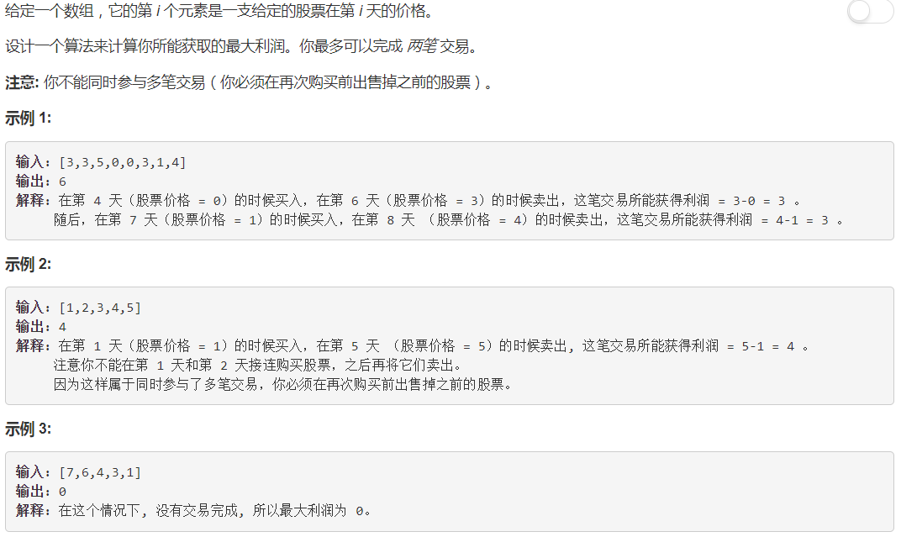

# 动态规划详解

### 123: Best Time to Buy and Sell Stock III ([cpp](Hard/123.best-time-to-buy-and-sell-stock-iii.cpp) [leetcode-cn](https://leetcode-cn.com/problems/best-time-to-buy-and-sell-stock-iii/description/))

- 请特别注意要求：最大只完成 **两笔** 交易。



#### 分析

- 定义变量：`dp[k, i]` , 在前 `i` 天中进行最多 `k` 笔交易所能获得的最大利润。
- 递推公式：前 `i` 天的交易可以根据第 `i` 天是否卖出分为两种情况，因此可以很容易得到递推公式：(其中 `j` 是买入日)
```
dp[k, i] = max(dp[k, i-1], prices[i] - prices[j] + dp[k-1, j-1]), j=[0...i-1]
         = max(dp[k, i-1], prices[i] - (prices[j] - dp[k-1, j-1]))
```

#### 1.最直接的实现方式：
```c++
int maxProfit(vector<int>& prices) {
    if (prices.size() < 2) return 0;
    int dp[3][prices.size()];
    for (int k = 0; k < 3; k++)
        for (int i = 0; i < prices.size(); i++)
            dp[k][i] = 0;
    for (int k = 1; k < 3; k++) {
        for (int i = 1; i < prices.size(); i++) {
            int mim = prices[0];  // prices[0] - 0
            for (int j = 1; j < i; j++)
                mim = min(mim, prices[j] - dp[k-1][j-1]);
            dp[k][i] = max(dp[k][i-1], prices[i] - mim);
        }
    }
    return dp[2][prices.size() - 1];
}
```
- 时间复杂度：$O(kn^2)$
- 空间复杂度：$O(kn)$

#### 2.避免 `mim` 的重复计算：
```c++
int maxProfit(vector<int>& prices) {
    if (prices.size() < 2) return 0;
    int dp[3][prices.size()];
    for (int k = 0; k < 3; k++)
        for (int i = 0; i < prices.size(); i++)
            dp[k][i] = 0;
    for (int k = 1; k < 3; k++) {
        int mim = prices[0];  // prices[0] - 0
        for (int i = 1; i < prices.size(); i++) {
            mim = min(mim, prices[i] - dp[k-1][i-1]);
            dp[k][i] = max(dp[k][i-1], prices[i] - mim);
        }
    }
    return dp[2][prices.size() - 1];
}
```
- 时间复杂度：$O(kn)$
- 空间复杂度：$O(kn)$

#### 2.避免 `mim` 的重复计算：
```c++
int maxProfit(vector<int>& prices) {
    if (prices.size() < 2) return 0;
    int dp[3][prices.size()];
    for (int k = 0; k < 3; k++)
        for (int i = 0; i < prices.size(); i++)
            dp[k][i] = 0;
    for (int k = 1; k < 3; k++) {
        int mim = prices[0];  // prices[0] - 0
        for (int i = 1; i < prices.size(); i++) {
            mim = min(mim, prices[i] - dp[k-1][i-1]);
            dp[k][i] = max(dp[k][i-1], prices[i] - mim);
        }
    }
    return dp[2][prices.size() - 1];
}
```
- 时间复杂度：$O(kn)$
- 空间复杂度：$O(kn)$

```c++
int maxProfit(vector<int>& prices) {
    if (prices.size() < 2) return 0;
    int dp[3];
    for (int k = 0; k < 3; k++)
        dp[k] = 0;
    for (int k = 1; k < 3; k++) {
        int mim = prices[0];  // prices[0] - 0
        for (int i = 1; i < prices.size(); i++) {
            mim = min(mim, prices[i] - dp[k-1]);
            dp[k] = max(dp[k], prices[i] - mim);
        }
    }
    return dp[2][prices.size() - 1];
}

#### 3.交换两个 `for loop`:
- 因为需要为每笔交易保存 `mim`，所以需要保存 `k` 个 `min`。
​```c++
int maxProfit(vector<int>& prices) {
    if (prices.size() < 2) return 0;
    int dp[3][prices.size()];
    for (int k = 0; k < 3; k++)
        for (int i = 0; i < prices.size(); i++)
            dp[k][i] = 0;
    int mim[3];
    for (int k = 0; k < 3; k++)
        mim[k] = prices[0];
    for (int i = 1; i < prices.size(); i++) {
        for (int k = 1; k < 3; k++) {
            mim[k] = min(mim[k], prices[i] - dp[k-1][i-1]);
            dp[k][i] = max(dp[k][i-1], prices[i] - mim[k]);
        }
    }
    return dp[2][prices.size() - 1];
}
```
- 时间复杂度：$O(kn)$
- 空间复杂度：$O(kn)$

#### 4.压缩 `i` 维空间：
- `dp` 空间第二维 `i` 变量 **只依赖** 于 `i-1`，并且随着 `i` 的递增，程序不需要 **读取历史数据** ，因此可以采用覆盖的方式复用变量，从而压缩额外空间。
- 需要注意的是，如果 `i` 是内部 `for i loop`， 将因为 `for k loop` 而导致需要从头读取历史数据，不能采用覆盖压缩的方式，因此交换内外循环是必要的。用额外的 `mim` 空间去交换 `i` 维压缩空间。
```c++
int maxProfit(vector<int>& prices) {
    if (prices.size() < 2) return 0;
    int dp[3], mim[3];
    for (int k = 0; k < 3; k++) {
        dp[k] = 0;
        mim[k] = prices[0];
    }
    for (int i = 1; i < prices.size(); i++) {
        for (int k = 1; k < 3; k++) {
            mim[k] = min(mim[k], prices[i] - dp[k-1]);
            dp[k] = max(dp[k], prices[i] - mim[k]);
        }
    }
    return dp[2];
}
```
- 时间复杂度：$O(kn)$
- 空间复杂度：$O(k)$

#### 5.采用全名变量
- 因为 `k=2`，因此可以采用全名变量来简化代码。
```c++
int maxProfit(vector<int>& prices) {
    int buy1 = 0x7fffffff, sell1 = 0;
    int buy2 = 0x7fffffff, sell2 = 0;
    for (int i = 0; i < prices.size(); i++) {
        buy1 = min(buy1, prices[i]);
        sell1 = max(sell1, prices[i] - buy1);
        buy2 = min(buy2, prices[i] - sell1);
        sell2 = max(sell2, prices[i] - buy2);
    }
    return sell2;
}
```
- 时间复杂度：$O(kn)$
- 空间复杂度：$O(k)$

#### 6.进一步理解性的解释
- `buy` : 可以理解为买入时的负收益：买入价-累积收益
- `sell` : 可以理解为卖出时的正收益，卖出收益-负收益
- 从正收益角度更容易理解，因此代码可以更易读：
```c++
int maxProfit(vector<int>& prices) {
    int buy1 = 0x80000000, sell1 = 0;
    int buy2 = 0x80000000, sell2 = 0;
    for (int i = 0; i < prices.size(); i++) {
        buy1  = max(buy1,  0     - prices[i]);  // 买入减收益
        sell1 = max(sell1, buy1  + prices[i]);  // 卖出增收益
        buy2  = max(buy2,  sell1 - prices[i]);  // 买入减收益
        sell2 = max(sell2, buy2  + prices[i]);  // 卖出增收益
    }
    return sell2
}
```

### 309: Best Time to Buy and Sell Stock with Cooldown ([cpp](Medium/309.best-time-to-buy-and-sell-stock-with-cooldown.cpp) [leetcode-cn](https://leetcode-cn.com/problems/best-time-to-buy-and-sell-stock-with-cooldown/description/))

- 定义变量： `dp[i]` 表示第 `i` 天的最大收益。
- 递推公式：第 `i` 天按照是否卖出分两种情况。( `j` 是买入日)
```
dp[i] = max(dp[i-1], dp[j-2] - prices[j] + prices[i]), j=[0...i-1]
```
- 分解递推公式可得：
```c++
buy[i]  = max(buy[i-1], sell[i-2] - prices[i]);  // 处于买入状态
sell[i] = max(sell[i-1], buy[i-1] + prices[i]);  // 处于卖出状态
```
因此我们需要三个依赖变量 (buy[i-1], sell[i-2], sell[i-1]) 和一个额外转移变量 buy[i]
所以有四个变量：`pre_buy, buy, pre_sell, sell`
```
pre_buy = buy;
buy = max(buy, pre_sell - prices[i]);
pre_sell = sell;
sell = max(sell, pre_buy + prices[i]);
```

#### O(n)的实现：
```c++
int maxProfit(vector<int>& prices) {
    if (prices.size() < 2) return 0;
    int dp[prices.size() + 1]; // add 1 more to guard
    dp[0] = 0;
    buy = -prices[0];
    for (int i = 2; i < prices.size(); i++) {
        buy = max(buy, dp[i-1] - prices[i]);
        dp[i+1] = max(dp[i], buy + prices[i]);
    }
    return dp[prices.size()-1];
}
```
- 时间复杂度：$O(n)$
- 空间复杂度：$O(n)$


#### 3.压缩 `i` 维空间
```c++
int maxProfit(vector<int>& prices) {
    if (prices.size() < 2) return 0;
    int sell1 = 0;
    int sell2 = max(0, prices[1] - prices[0]);
    int buy = max(-prices[0], -prices[1]);
    int sell;
    for (int i = 2; i < prices.size(); i++) {
        buy = max(buy, sell1 - prices[i]);
        sell1 = sell2;
        sell2 = max(sell2, buy + prices[i]);
    }
    return sell2;
}
```


原文参考: [Detail explanation of DP solution](https://leetcode.com/problems/best-time-to-buy-and-sell-stock-iii/discuss/135704/Detail-explanation-of-DP-solution)
